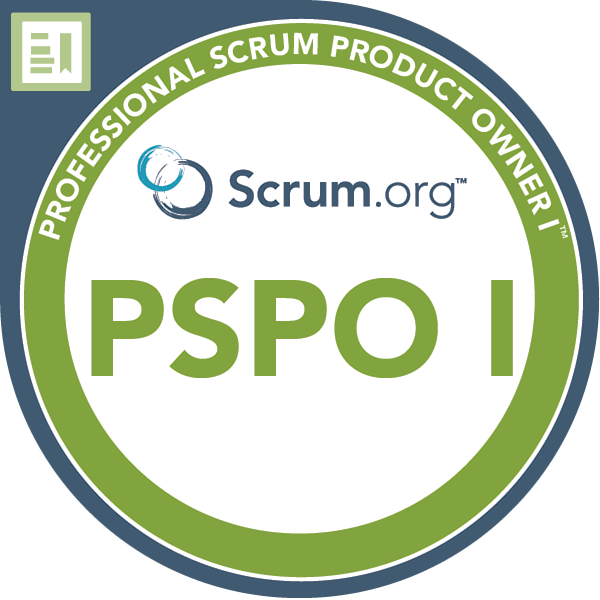
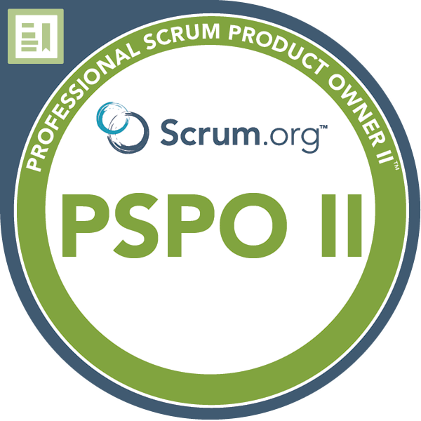
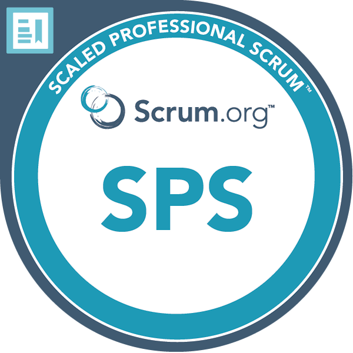
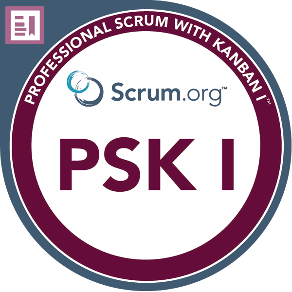
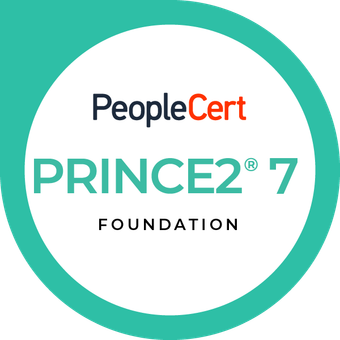
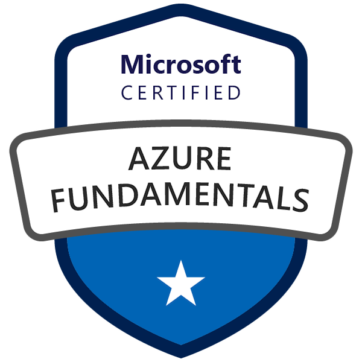
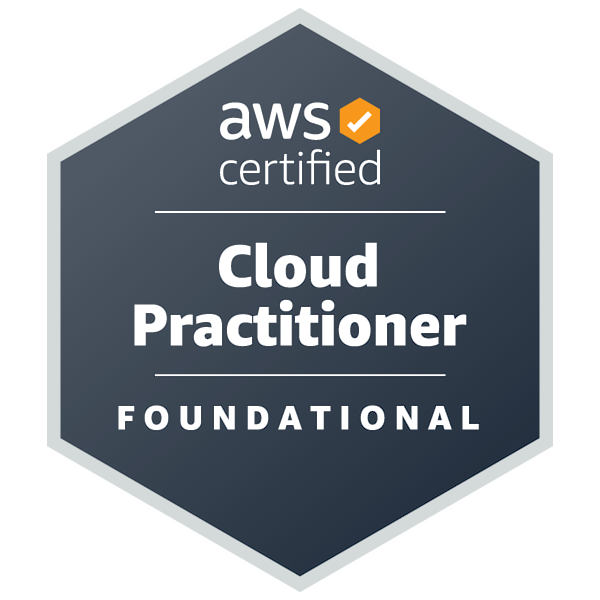
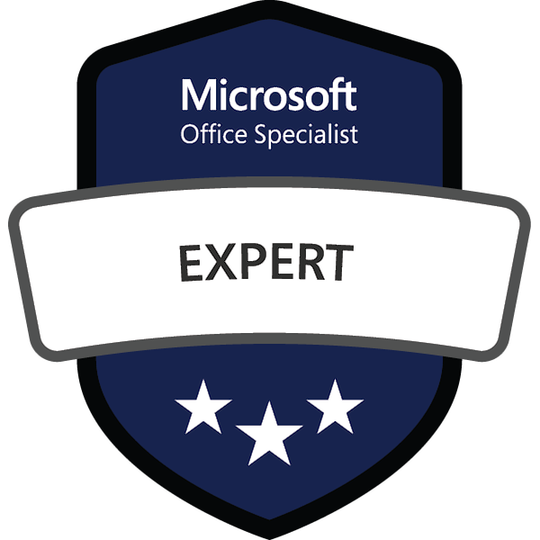

<!-- IT Consultant | Agile Project Management | creator of Scrum.wiki -->
## IT Consultant | creator of Scrum.wiki

I am an IT Consultant specialized in Agile software development.
I can help you manage your IT projects, develop IT products, and run teams efficiently using Agile methodologies.

## How I work 🖊️

My approach is centred around people, the most complex part of IT.
I focus on understanding the motivations of each individual and how the create value.
I aim to be honest, direct, and respectful with everyone.
Establishing processes that align with the company culture is crucial, as technology choices become secondary once these processes are in place.

Thanks to my background in mathematics, I am analytical and detail-oriented. I can filter out what is unnecessary and understand all relevant information thoroughly. This allows me to gain a deep understanding of both the managerial and technical aspects of the organization.

## Experience 💼

I have 10+ experience in IT transformation projects, including introducing Agile practices, change management, process optimization, and test management. My customers include large international organizations in Insurance and Automotive

When I am not generating value for my customers, I enjoy contributing on [GitHub](https://github.com/lucafrance) or writing on my [blog](https://lucaf.eu/blog) about [project management](https://lucaf.eu/tags.html#Project%20Management) and [AI](https://lucaf.eu/tags.html#AI).

I also like to learn and [write](https://lucaf.eu/tags.html#Scrum) about Scrum, which is a great framework whether followed in its entirety or just used as an inspiration. 
This is why I created [Scrum.wiki](https://scrum.wiki) to promote and share its [values](https://scrum.wiki/Scrum%20Values).

## Certified Scrum.org Professional | PRINCE2 Foundation 📜

[{: width="85"}](https://www.credly.com/badges/3137ece2-15b9-4f41-ab8f-4bf1030f8eed/public_url)
[{: width="85"}](https://www.credly.com/badges/0c643fef-cc27-4091-8b50-11e63629e1df/public_url)
[{: width="85"}](https://www.credly.com/badges/0236fce4-c6c0-4518-aba4-ace0f3721ea6/public_url)
[{: width="85"}](https://www.credly.com/badges/f34e69fd-2714-40e1-8611-5ccdfd869a79/public_url)
{: width="85"}
[{: width="85"}](https://www.credly.com/badges/b2e7fca0-aeb9-4521-b8e8-4a74d05fe252/public_url)
[{: width="85"}](https://www.credly.com/badges/8bb5949f-1493-4e62-9e2f-44a0a9bc4338/public_url)
[{: width="85"}](https://www.credly.com/badges/d3010017-2a96-4392-82ec-7779ca3f24d4/public_url)
