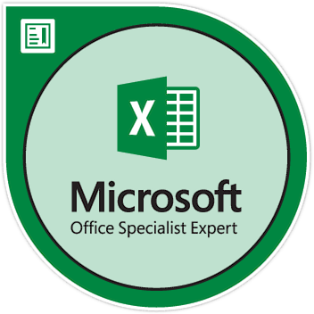

As an experienced IT consultant specializing in Agile project management, I have a strong background in the (re-)insurance and automotive sectors.
My experience spans international environments, where I have successfully led projects, optimized processes, and implemented automation to enhance efficiency.

I am also the creator of [scrum.wiki](https://scrum.wiki), a comprehensive online resource dedicated to the Scrum framework; and [luca-decimal](https://github.com/lucafrance/luca-decimal), a knowledge management system.

<!-- Scrum.org certifications -->
[{: width="80"}](https://www.credly.com/badges/3137ece2-15b9-4f41-ab8f-4bf1030f8eed/public_url)
[{: width="80"}](https://www.credly.com/badges/0c643fef-cc27-4091-8b50-11e63629e1df/public_url)
[{: width="80"}](https://www.credly.com/badges/0236fce4-c6c0-4518-aba4-ace0f3721ea6/public_url)
[{: width="80"}](https://www.credly.com/badges/f34e69fd-2714-40e1-8611-5ccdfd869a79/public_url)

<!-- PRINCE2 + Cloud certifications -->
{: width="80"}
[{: width="80"}](https://www.credly.com/badges/b2e7fca0-aeb9-4521-b8e8-4a74d05fe252/public_url)
[{: width="80"}](https://www.credly.com/badges/8bb5949f-1493-4e62-9e2f-44a0a9bc4338/public_url)

<!-- Microsoft Office certifications -->
[{: width="80"}](https://www.credly.com/badges/d645a896-d129-4150-86b3-10bef7d4143c/public_url)
[{: width="80"}](https://www.credly.com/badges/d3010017-2a96-4392-82ec-7779ca3f24d4/public_url)
